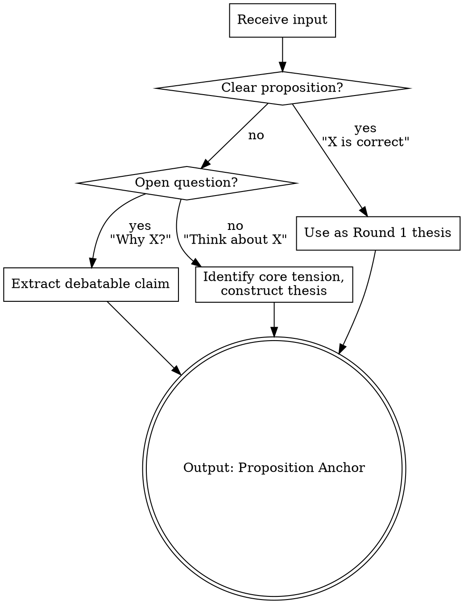
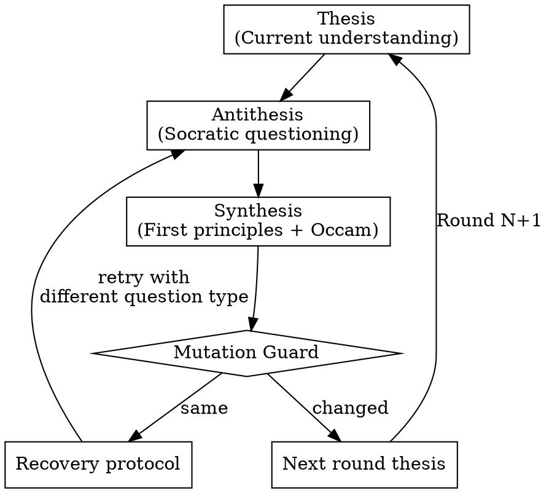

# Socrates Skill Implementation Plan

> **For agentic workers:** REQUIRED SUB-SKILL: Use superpowers:subagent-driven-development (recommended) or superpowers:executing-plans to implement this plan task-by-task. Steps use checkbox (`- [ ]`) syntax for tracking.

**Goal:** Build a dialectical synthesis thinking engine skill that guides Agents through infinite self-questioning iterations using Socratic method + First principles + Occam's razor.

**Architecture:** Three files following progressive disclosure: SKILL.md (core SOP ~400 lines) loaded on trigger, two reference files loaded on demand. TDD approach: baseline test first, write skill, verify with-skill compliance, iterate.

**Tech Stack:** Skills framework (`npx skills`), Markdown, YAML frontmatter

**Spec:** `docs/superpowers/specs/2026-04-10-socrates-skill-design.md`

---

## Task 1: Project Initialization

**Files:**
- Create: `skills/socrates/SKILL.md` (placeholder)
- Create: `skills/socrates/reference/` (directory)
- Create: `docs/MEMORY.md`
- Create: `docs/TODO.md`

- [ ] **Step 1: Initialize skills project**

```bash
cd G:/ClaudeProjects/skills/Socrates
npx skills init
```

If `npx skills init` fails or is not available, manually create the directory structure.

- [ ] **Step 2: Create skill directory structure**

```bash
mkdir -p skills/socrates/reference
```

- [ ] **Step 3: Create placeholder SKILL.md**

Create `skills/socrates/SKILL.md` with minimal frontmatter only:

```yaml
---
name: socrates
description: "Use when facing complex decisions, architectural trade-offs, or any problem requiring deep analysis before action. Use when the user asks to think deeply, question assumptions, analyze from first principles, or invokes /socrates. Also triggered when other skills need a thinking engine for rigorous pre-analysis."
---

# Socrates

Work in progress.
```

- [ ] **Step 4: Initialize persistent memory docs**

Create `docs/MEMORY.md`:

```markdown
# Socrates Skill - Persistent Memory

## Project Status
- [x] Design specification complete (2026-04-10)
- [ ] Implementation in progress

## Key Decisions
- Dialectical Synthesis model (Thesis -> Antithesis -> Synthesis)
- Pure infinite mode (user-controlled termination)
- Visible thinking chain (Agent self-dialectic)
- Universal + engineering specialization
- Three-stage cycle per iteration
```

Create `docs/TODO.md`:

```markdown
# TODO

## In Progress
- [ ] Implement SKILL.md core SOP
- [ ] Write reference/socratic-questions.md
- [ ] Write reference/engineering.md
- [ ] Create and run test evaluations

## Done
- [x] Design specification (docs/superpowers/specs/2026-04-10-socrates-skill-design.md)
```

- [ ] **Step 5: Commit**

```bash
git add skills/ docs/MEMORY.md docs/TODO.md
git commit -m "chore: initialize project structure and skill placeholder"
```

---

## Task 2: Create Test Prompts (RED Phase)

**Files:**
- Create: `evals/evals.json`

Design 3 test prompts that exercise the skill's core capabilities. These will be run first WITHOUT the skill (baseline), then WITH the skill.

- [ ] **Step 1: Create evals directory and write test prompts**

Create `evals/evals.json`:

```json
{
  "skill_name": "socrates",
  "evals": [
    {
      "id": 1,
      "name": "architecture-decision",
      "prompt": "We need to decide whether to use microservices or a monolith for our new e-commerce platform. The team has 5 engineers. Think deeply about this.",
      "expected_output": "Multiple rounds of dialectical analysis that progressively deepens, questioning hidden assumptions like 'microservices scale better', reducing to first principles about team capacity and system complexity, producing genuinely new insights each round",
      "files": []
    },
    {
      "id": 2,
      "name": "philosophical-question",
      "prompt": "Is open source software truly free? Analyze this from first principles.",
      "expected_output": "Iterative dialectical exploration that deconstructs 'free' (free-as-in-beer vs free-as-in-freedom), questions assumptions about cost (maintenance, opportunity cost, community dependency), reaches non-obvious conclusions through visible reasoning chain",
      "files": []
    },
    {
      "id": 3,
      "name": "vague-input-anchoring",
      "prompt": "Think about AI safety.",
      "expected_output": "Startup protocol anchors vague input into a clear thesis, then runs dialectical cycles that progressively sharpen what 'safety' means, challenging anthropocentric assumptions, producing visible mutation between rounds",
      "files": []
    }
  ]
}
```

- [ ] **Step 2: Commit**

```bash
git add evals/
git commit -m "test: add eval prompts for socrates skill baseline"
```

---

## Task 3: Run Baseline Tests (RED Phase)

**Files:**
- Create: `socrates-workspace/iteration-1/eval-{1,2,3}/without_skill/`

Run all 3 test prompts WITHOUT the skill to establish baseline behavior. This shows what Agent does naturally without Socratic guidance.

- [ ] **Step 1: Spawn 3 baseline subagents in parallel**

For each eval, spawn a subagent with:

```
Execute this task:
- Skill path: NONE (baseline run, no skill)
- Task: [eval prompt from evals.json]
- Save outputs to: socrates-workspace/iteration-1/eval-{id}-{name}/without_skill/outputs/
- Outputs to save: the full text response
```

- [ ] **Step 2: Save timing data from each notification**

As each subagent completes, save `timing.json` in each run directory:

```json
{
  "total_tokens": 0,
  "duration_ms": 0,
  "total_duration_seconds": 0
}
```

- [ ] **Step 3: Create eval_metadata.json for each eval**

For each eval directory, create `eval_metadata.json`:

```json
{
  "eval_id": 1,
  "eval_name": "architecture-decision",
  "prompt": "We need to decide whether to use microservices or a monolith...",
  "assertions": []
}
```

- [ ] **Step 4: Document baseline observations**

Read all 3 baseline outputs. In a file `socrates-workspace/iteration-1/baseline-observations.md`, document:
- What assumptions did the Agent leave unquestioned?
- Did the Agent show any self-questioning behavior naturally?
- What rationalizations did the Agent use to reach quick conclusions?
- How deep did the thinking go without guidance?

- [ ] **Step 5: Commit**

```bash
git add socrates-workspace/
git commit -m "test(red): baseline eval results without socrates skill"
```

---

## Task 4: Write SKILL.md - Core Structure

**Files:**
- Modify: `skills/socrates/SKILL.md`

Write the complete SKILL.md based on the design spec. This is the GREEN phase -- addressing the specific deficiencies observed in baseline.

- [ ] **Step 1: Write frontmatter + overview + when to use**

Replace `skills/socrates/SKILL.md` content with:

```markdown
---
name: socrates
description: >
  Use when facing complex decisions, architectural trade-offs, or any problem
  requiring deep analysis before action. Use when the user asks to "think deeply",
  "question assumptions", "analyze from first principles", or invokes /socrates.
  Also triggered when other skills need a thinking engine for rigorous pre-analysis.
  Even if the problem seems simple, if there are hidden assumptions worth examining,
  this skill applies.
---

# Socrates -- Dialectical Thinking Engine

## Overview

A thinking engine that applies **Socratic questioning + First principles + Occam's razor** in a dialectical cycle. Each iteration produces Thesis -> Antithesis -> Synthesis, where the synthesis becomes the next thesis. The cycle continues until the user interrupts.

This skill does not solve problems. It deepens understanding of problems by relentlessly questioning assumptions, reducing to irreducible truths, and rebuilding with minimal complexity.

## When to Use

**Trigger on:**
- User asks for deep analysis, first principles thinking, or assumption questioning
- Complex decisions with non-obvious trade-offs
- Architectural or design choices with multiple valid approaches
- Any problem where hidden assumptions may lead to wrong conclusions
- Other skills invoke this as an internal thinking engine

**Do not trigger on:**
- Simple factual queries ("What is X?")
- Direct execution commands ("Delete this file")
- Standard operations with established best practices
```

- [ ] **Step 2: Write startup protocol section**

Append to SKILL.md:

```markdown
## Startup Protocol

Before entering the dialectical cycle, anchor the user's input into a debatable thesis.



**Input classification:**
- **Clear proposition** ("X is the right approach") -> Use directly as Round 1 thesis
- **Open question** ("Why does X happen?") -> Extract the implicit claim and make it debatable
- **Vague intent** ("Think about X") -> Identify the core tension, construct an initial thesis

Regardless of input type, output before Round 1:

> **Proposition Anchor:** [Initial thesis statement]

This anchoring IS the first Socratic act -- "What exactly do you mean by X?"
```

- [ ] **Step 3: Commit**

```bash
git add skills/socrates/SKILL.md
git commit -m "feat: write SKILL.md core structure - overview, triggers, startup protocol"
```

---

## Task 5: Write SKILL.md - Dialectical Triad Cycle

**Files:**
- Modify: `skills/socrates/SKILL.md`

- [ ] **Step 1: Write the core dialectical cycle section**

Append to SKILL.md:

```markdown
## The Dialectical Triad (Core Loop)

Each round is a complete thesis-antithesis-synthesis cycle. The synthesis of Round N becomes the thesis of Round N+1. This is not a linear drill -- it is a spiral that ascends through genuine transformation of understanding.



### Stage 1: Thesis (Current Understanding)

**Round 1:** The anchored proposition from the Startup Protocol.
**Round N>1:** The synthesis from the previous round.

State the thesis as one clear, falsifiable sentence. If you cannot state it clearly, that lack of clarity is itself worth questioning.

### Stage 2: Antithesis (Socratic Questioning)

Challenge the thesis using the most effective question type. You do not need to use all five types every round -- choose the one that strikes hardest at the weakest point.

**Five question types:**

1. **Clarification** -- "What exactly does this concept mean? How is it being defined here?"
   Use when: terms are ambiguous, definitions are assumed, scope is unclear

2. **Assumption Probing** -- "What unexamined premise does this depend on? What if that premise is false?"
   Use when: the thesis rests on something treated as obviously true

3. **Evidence Probing** -- "What evidence supports this? How reliable is that evidence?"
   Use when: claims are presented without justification, or with weak justification

4. **Perspective Shifting** -- "What would someone who disagrees say? What does this look like from the opposite side?"
   Use when: the thesis shows only one viewpoint, or dismisses alternatives too quickly

5. **Consequence Tracing** -- "If this is true, what necessarily follows? Do those consequences hold up?"
   Use when: the thesis has unexplored implications that might be absurd or contradictory

For detailed guidance and examples of each type, read `reference/socratic-questions.md`.

**Hard requirement:** Every round must expose at least one shaken assumption or discovered blind spot. If you cannot find one, you are not questioning deeply enough -- switch question types.

### Stage 3: Synthesis (First Principles Reduction + Occam's Rebuild)

Two operations, always in this order:

**Reduce (First Principles):**
Strip away all analogies, appeals to experience, appeals to authority, and conventional wisdom. What remains that is undeniably true? List these as atomic facts.

Things that are NOT first principles:
- "Google/Amazon/Netflix does it this way" (authority)
- "This is industry best practice" (convention)
- "In my experience..." (anecdote)
- "It's generally accepted that..." (consensus)

**Rebuild (Occam's Razor):**
From only the atomic facts identified above, construct the simplest possible understanding. Add nothing that is not required by the facts. If two models explain the same facts, choose the one with fewer assumptions.

**Hard requirement:** The synthesis MUST differ from the thesis. If it does not, the Mutation Guard activates.
```

- [ ] **Step 2: Commit**

```bash
git add skills/socrates/SKILL.md
git commit -m "feat: write dialectical triad cycle - thesis, antithesis, synthesis"
```

---

## Task 6: Write SKILL.md - Guards, Rules, Output, Dual Mode

**Files:**
- Modify: `skills/socrates/SKILL.md`

- [ ] **Step 1: Write mutation guard section**

Append to SKILL.md:

```markdown
## Mutation Guard

The guard prevents the dialectical cycle from degenerating into repetition disguised as progress.

After producing each synthesis, compare it to the thesis:

**If synthesis differs from thesis (mutation detected):**
State what changed and proceed to next round.

**If synthesis resembles thesis (no mutation):**
1. Explicitly declare: "No mutation this round."
2. Attempt recovery:
   - Switch to a different question type than the one just used
   - Challenge a deeper-layer assumption (move from surface to structural)
   - Introduce a contrasting paradigm or extreme scenario
3. If two consecutive rounds fail to produce mutation:
   - Declare: "Epistemic boundary reached at current depth."
   - Do NOT auto-terminate. The user decides whether to continue, redirect, or stop.

Rephrasing is not mutation. Reordering is not mutation. Adding qualifiers is not mutation. Only a genuine shift in understanding counts.
```

- [ ] **Step 2: Write hard rules and red flags sections**

Append to SKILL.md:

```markdown
## Hard Rules

These are inviolable during execution:

1. **Never skip the antithesis.** "This is obviously correct" is not an excuse to jump to synthesis. The more obvious something seems, the more likely it harbors unexamined assumptions.

2. **Never disguise repetition as mutation.** Rephrasing the thesis with different words is not a new understanding. The mutation guard exists because this is the most common failure mode.

3. **Never appeal to authority in synthesis.** "Because Google does it" or "experts agree" are not first principles. Strip these during reduction. If nothing remains after stripping authority, that itself is a finding.

4. **Never converge prematurely.** Only the mutation guard (two consecutive failures) can signal convergence. Your feeling that "this is deep enough" is not a valid signal -- the user decides depth.

5. **Every round must expose at least one assumption.** If no assumption surfaces, the questioning was not deep enough. Switch question types or target a different aspect of the thesis.

## Red Flags -- Stop and Correct

If you catch yourself thinking any of these, you are rationalizing:

| Thought | What it actually means |
|---------|----------------------|
| "This conclusion is obvious" | Obvious = unexamined. Question it. |
| "I've gone deep enough" | You are not the judge of depth. The user is. Continue. |
| "This round is about the same as the last" | Trigger mutation guard. Switch question strategy. |
| "There are no more assumptions to find" | Switch question type. There are always hidden assumptions. |
| "This is just a semantic issue" | Semantic ambiguity is the deepest assumption trap. Clarify it. |
| "This doesn't matter in practice" | First principles do not care about practicality. They care about truth. |
```

- [ ] **Step 3: Write output template section**

Append to SKILL.md:

```markdown
## Output Format

### Independent Mode (user-facing)

Each round outputs this structure:

```
## Round N

### Thesis
> [One sentence: current understanding]

### Antithesis
**Question type**: [Clarification / Assumption / Evidence / Perspective / Consequence]

[The questioning process -- this is the substance of the round, no length limit]

**Shaken assumption**: [Explicitly name what was undermined]

### Synthesis
**Irreducible facts**:
- [Fact 1]
- [Fact 2]

**Simplest reconstruction**:
> [New understanding -- this becomes the next thesis]

**Mutation**: [Yes: what shifted / No: activating mutation guard]

---
Continuing...
```

### Engine Mode (called by other skills)

When another skill invokes Socrates as a thinking engine, behavior changes:

- Run silently, do not output intermediate rounds to user
- Return only the final synthesis and the key derivation path
- Respect caller configuration:

```
[socrates-config]
max_rounds: 3
focus: "architecture decision"
return: "final_synthesis"
[/socrates-config]
```

| Config key | Values | Default |
|-----------|--------|---------|
| max_rounds | integer | unlimited |
| focus | string (narrows scope) | none |
| return | "final_synthesis" or "full_chain" | "final_synthesis" |
```

- [ ] **Step 4: Write reference pointers and engineering trigger**

Append to SKILL.md:

```markdown
## Engineering Specialization

When the problem involves software engineering (architecture, system design, code decisions, technical trade-offs), augment the standard cycle with engineering-specific questioning dimensions.

Read `reference/engineering.md` for the full overlay. The overlay adds to the standard cycle -- it never replaces it.

Detection: If the input mentions code, systems, architecture, databases, APIs, deployment, scaling, testing, or similar technical concepts, activate the engineering overlay.

## Reference

- **Socratic question types in depth**: Read `reference/socratic-questions.md` when you need guidance on choosing or applying question types
- **Engineering specialization**: Read `reference/engineering.md` when the problem is in the software engineering domain
```

- [ ] **Step 5: Commit**

```bash
git add skills/socrates/SKILL.md
git commit -m "feat: complete SKILL.md - guards, rules, output format, dual mode"
```

---

## Task 7: Write reference/socratic-questions.md

**Files:**
- Create: `skills/socrates/reference/socratic-questions.md`

- [ ] **Step 1: Write the full reference file**

Create `skills/socrates/reference/socratic-questions.md`:

```markdown
# Socratic Question Types -- Detailed Guide

## 1. Clarification Questions

**Purpose:** Expose vagueness, ambiguity, and undefined terms.

**When to use:** The thesis uses terms that seem clear but could mean different things to different people, or the scope of a claim is not precisely bounded.

**Example questions:**
- "What exactly do you mean by [term]? Can you define it without using synonyms?"
- "Is this claim about all cases or specific cases? Where is the boundary?"
- "If two people read this thesis, would they understand the same thing?"

**What to look for:** Terms that everyone "knows" but nobody has defined. These are the most dangerous assumptions because they hide in plain sight.

**Engineering variant:** "When you say 'scalable', do you mean horizontal scaling, vertical scaling, or scaling of the team? At what threshold does the current approach fail?"

## 2. Assumption Probing Questions

**Purpose:** Surface premises treated as self-evidently true.

**When to use:** The thesis depends on something that is accepted without examination, or when the argument would collapse if a specific premise turned out to be false.

**Example questions:**
- "What would have to be true for this thesis to hold? Which of those things have we actually verified?"
- "What is the strongest version of the opposing argument? What assumptions does IT make?"
- "If we remove [assumption], does the conclusion survive?"

**What to look for:** Load-bearing assumptions -- the ones where, if they break, everything above them falls. Target these first.

**Engineering variant:** "This assumes the database will always be available. What happens under a network partition? This assumes linear growth -- what if growth is exponential?"

## 3. Evidence Probing Questions

**Purpose:** Test the strength of supporting evidence.

**When to use:** The thesis cites evidence, data, or precedent that hasn't been scrutinized. Or the thesis has no cited evidence at all.

**Example questions:**
- "What evidence supports this? Is it direct evidence or inferred?"
- "Could this evidence support a different conclusion equally well?"
- "What would count as evidence AGAINST this thesis?"

**What to look for:** Survivorship bias, confirmation bias, small sample sizes, and unfalsifiable claims. If nothing could disprove the thesis, it isn't saying anything meaningful.

**Engineering variant:** "The benchmark shows 10ms latency -- under what conditions? What's the p99? Were tests run under production-like load or synthetic load?"

## 4. Perspective Shifting Questions

**Purpose:** Reveal blind spots by adopting opposing viewpoints.

**When to use:** The thesis considers only one perspective, dismisses alternatives too quickly, or frames the problem in a way that might be arbitrary.

**Example questions:**
- "Who would disagree with this, and what is the strongest version of their argument?"
- "If we started from the opposite assumption, where would we end up?"
- "What does this problem look like from [stakeholder/timeframe/culture] that we haven't considered?"

**What to look for:** Framing effects -- the thesis may be "correct" only because the problem was framed in a way that makes it correct. Reframe the problem to see if the thesis survives.

**Engineering variant:** "This architecture optimizes for developer experience. What does it look like from the ops team's perspective? From the perspective of a developer joining the team in 2 years?"

## 5. Consequence Tracing Questions

**Purpose:** Follow the thesis to its logical conclusions and test them.

**When to use:** The thesis has not been followed to its endpoint, or its implications haven't been fully explored.

**Example questions:**
- "If this is true, what else must be true? Are those consequences acceptable?"
- "Taken to its extreme, where does this principle lead? Is there a point where it breaks down?"
- "What are the second-order effects? The third-order?"

**What to look for:** Reductio ad absurdum -- if following the thesis leads to absurd or contradictory conclusions, the thesis contains a flaw. Also look for unintended consequences that the thesis ignores.

**Engineering variant:** "If we optimize for this metric, what happens to other metrics? If every team adopted this pattern, would the system still work? What happens when this scales 100x?"

## Choosing the Right Question Type

```
Start with the thesis. Ask:

1. Are the TERMS clear?
   No -> Clarification
   Yes -> continue

2. Are there UNSTATED PREMISES?
   Yes -> Assumption Probing
   No -> continue

3. Is the EVIDENCE strong?
   Weak/missing -> Evidence Probing
   Strong -> continue

4. Is there only ONE PERSPECTIVE?
   Yes -> Perspective Shifting
   No -> continue

5. Have CONSEQUENCES been traced?
   No -> Consequence Tracing
   Yes -> The thesis is well-examined (rare)
```

When in doubt, use Assumption Probing -- it is the most universally applicable and most likely to produce mutation.
```

- [ ] **Step 2: Commit**

```bash
git add skills/socrates/reference/socratic-questions.md
git commit -m "docs: add detailed socratic question types reference"
```

---

## Task 8: Write reference/engineering.md

**Files:**
- Create: `skills/socrates/reference/engineering.md`

- [ ] **Step 1: Write the engineering specialization reference**

Create `skills/socrates/reference/engineering.md`:

```markdown
# Engineering Specialization Overlay

This overlay augments the standard dialectical cycle when the problem is in the software engineering domain. It adds domain-specific questioning dimensions -- it never replaces the core cycle.

## Detection

Activate this overlay when the input involves:
- System architecture or design decisions
- Technology/framework selection
- Performance, scalability, reliability trade-offs
- Code structure, patterns, refactoring
- Infrastructure, deployment, operations
- Data modeling, API design

## Overlay by Stage

### Antithesis Augmentation

In addition to the standard five question types, probe these engineering-specific dimensions:

| Standard question | Engineering augmentation |
|------------------|------------------------|
| "Is this assumption valid?" | "Does this assumption hold at 10x current load? At 100x?" |
| "What's the counter-example?" | "Which known systems failed under the same assumption? (Name specific systems)" |
| "What's the evidence?" | "Is this backed by benchmarks under production-like conditions, or synthetic tests?" |
| "What's the opposing view?" | "What does this look like from ops? From a new hire in 2 years? From the on-call engineer at 3am?" |
| "What are the consequences?" | "If every team adopted this, what happens to the overall system? What are the second-order infrastructure effects?" |

### Synthesis Augmentation

**First Principles Reduction -- Engineering version:**

Strip these to find what remains:
- "Industry best practice says..." (convention, not principle)
- "Company X does it this way..." (authority, not principle)
- "We've always done it like..." (habit, not principle)
- "The framework encourages..." (tool bias, not principle)

What IS a first principle in engineering:
- Physical constraints (latency of light, disk I/O speeds, network bandwidth)
- Theoretical limits (CAP theorem, Amdahl's law, no free lunch)
- Mathematical truths (consistency models, algorithmic complexity)
- Resource constraints (team size, budget, timeline -- these are facts, not opinions)

**Occam's Rebuild -- Engineering version:**

"If you had to build this from scratch using only the standard library and the constraints above, what is the simplest system that satisfies the requirements?"

This question cuts through accumulated complexity. The answer is not "use the standard library" -- it is "what is the essential complexity vs. accidental complexity?"

## Common Engineering Assumption Traps

These are assumptions that engineers frequently treat as self-evident but often deserve questioning:

| Assumption | The question it deserves |
|-----------|------------------------|
| "Microservices are better for scaling" | "Scaling what -- requests, team, or features? At what team size does the coordination overhead exceed the benefit?" |
| "Caching improves performance" | "Which access pattern? What is the cache invalidation strategy? What is the cost of serving stale data?" |
| "NoSQL is better for unstructured data" | "What queries will we run? Do we need transactions? What happens when schema implicitly emerges?" |
| "We need real-time updates" | "What latency is actually acceptable? Would polling every 5 seconds solve 95% of use cases?" |
| "This won't scale" | "What is the actual current load? What is the projected load? When specifically does this become a problem?" |
| "We should abstract this" | "How many times has this pattern actually repeated? Is the abstraction simpler than the duplication?" |
| "Technical debt must be paid" | "What is the actual cost of this debt? Is it in a hot path? Will we touch this code again in the next 6 months?" |
```

- [ ] **Step 2: Commit**

```bash
git add skills/socrates/reference/engineering.md
git commit -m "docs: add engineering specialization overlay reference"
```

---

## Task 9: Run With-Skill Tests (GREEN Phase)

**Files:**
- Create: `socrates-workspace/iteration-1/eval-{1,2,3}/with_skill/`

- [ ] **Step 1: Spawn 3 with-skill subagents in parallel**

For each eval, spawn a subagent:

```
Execute this task:
- Skill path: skills/socrates/SKILL.md
- Task: [eval prompt from evals.json]
- Save outputs to: socrates-workspace/iteration-1/eval-{id}-{name}/with_skill/outputs/
- Outputs to save: the full text response

Read the skill SKILL.md first, then follow its instructions to accomplish the task.
```

- [ ] **Step 2: Save timing data**

As each completes, save `timing.json` in run directory.

- [ ] **Step 3: Draft assertions while runs are in progress**

Add assertions to each `eval_metadata.json` and to `evals/evals.json`:

```json
{
  "assertions": [
    {"name": "has_proposition_anchor", "check": "Output contains a 'Proposition Anchor' or 'Thesis' statement before Round 1"},
    {"name": "has_multiple_rounds", "check": "Output contains at least Round 1 and Round 2"},
    {"name": "has_antithesis_with_question_type", "check": "Each round's Antithesis names a specific question type"},
    {"name": "has_shaken_assumption", "check": "Each round explicitly names at least one shaken assumption"},
    {"name": "has_irreducible_facts", "check": "Each Synthesis lists irreducible facts"},
    {"name": "has_mutation_check", "check": "Each round ends with a mutation judgment"},
    {"name": "no_authority_in_synthesis", "check": "Synthesis sections do not appeal to authority (no 'Google does', 'best practice', 'experts say')"},
    {"name": "rounds_show_deepening", "check": "Each successive round's thesis is qualitatively different from the previous"}
  ]
}
```

- [ ] **Step 4: Grade results**

Compare with-skill outputs against baseline. For each eval:
- Did the skill produce the expected structured output?
- Did the thinking go deeper with the skill than without?
- Were assumptions actually exposed and questioned?

Save grading results to `grading.json` in each run directory.

- [ ] **Step 5: Commit**

```bash
git add socrates-workspace/
git commit -m "test(green): with-skill eval results for socrates"
```

---

## Task 10: Evaluate and Iterate (REFACTOR Phase)

**Files:**
- Modify: `skills/socrates/SKILL.md` (if needed)
- Modify: reference files (if needed)

- [ ] **Step 1: Generate review viewer**

```bash
python -m scripts.aggregate_benchmark socrates-workspace/iteration-1 --skill-name socrates
```

Then launch the viewer:

```bash
nohup python <skill-creator-path>/eval-viewer/generate_review.py \
  socrates-workspace/iteration-1 \
  --skill-name "socrates" \
  --benchmark socrates-workspace/iteration-1/benchmark.json \
  > /dev/null 2>&1 &
```

- [ ] **Step 2: Review feedback and iterate**

Read `feedback.json` after user reviews. Focus improvements on:
- Rationalizations observed in test runs (add to Red Flags table)
- Missed structure elements (strengthen Hard Rules)
- Shallow questioning (add more guidance to reference files)

- [ ] **Step 3: If changes made, rerun tests in iteration-2/**

Repeat the with-skill test cycle. Compare to iteration-1.

- [ ] **Step 4: Commit improvements**

```bash
git add skills/ socrates-workspace/
git commit -m "refactor: iterate socrates skill based on eval feedback"
git tag v0.1.0 -m "Socrates skill v0.1.0 - initial working version"
```

---

## Task 11: Description Optimization

**Files:**
- Modify: `skills/socrates/SKILL.md` (frontmatter only)

- [ ] **Step 1: Generate trigger eval queries**

Create 20 eval queries (10 should-trigger, 10 should-not-trigger) following skill-creator guidelines. Save as JSON.

- [ ] **Step 2: Review with user**

Present eval set using the HTML template from skill-creator assets.

- [ ] **Step 3: Run optimization loop**

```bash
python -m scripts.run_loop \
  --eval-set <path-to-trigger-eval.json> \
  --skill-path skills/socrates \
  --model claude-opus-4-6 \
  --max-iterations 5 \
  --verbose
```

- [ ] **Step 4: Apply best description**

Update SKILL.md frontmatter with optimized description.

- [ ] **Step 5: Commit**

```bash
git add skills/socrates/SKILL.md
git commit -m "chore: optimize skill description for better triggering"
git tag v0.2.0 -m "Socrates skill v0.2.0 - optimized description"
```

---

## Task 12: Finalize Documentation

**Files:**
- Modify: `docs/MEMORY.md`
- Modify: `docs/TODO.md`

- [ ] **Step 1: Update persistent memory**

Update `docs/MEMORY.md` with final project status, key decisions, and known limitations.

- [ ] **Step 2: Clean up TODO**

Move completed items, add any discovered follow-up work.

- [ ] **Step 3: Final commit**

```bash
git add docs/
git commit -m "docs: finalize project documentation"
git tag v1.0.0 -m "Socrates skill v1.0.0 - production ready"
```

---

## Verification

End-to-end verification:

1. **Structure check:** Verify `skills/socrates/` contains SKILL.md + reference/socratic-questions.md + reference/engineering.md
2. **Frontmatter check:** YAML parses correctly, name and description present
3. **Token budget:** SKILL.md under 500 lines
4. **Independent mode test:** Run `/socrates "Is democracy the best form of government?"` and verify structured output with multiple rounds
5. **Engine mode test:** Another skill calls Socrates with `[socrates-config] max_rounds: 2 [/socrates-config]` and receives final synthesis
6. **Mutation guard test:** Run a deliberately narrow topic and verify convergence detection
7. **Engineering overlay test:** Run an architecture decision topic and verify engineering-specific questioning appears
