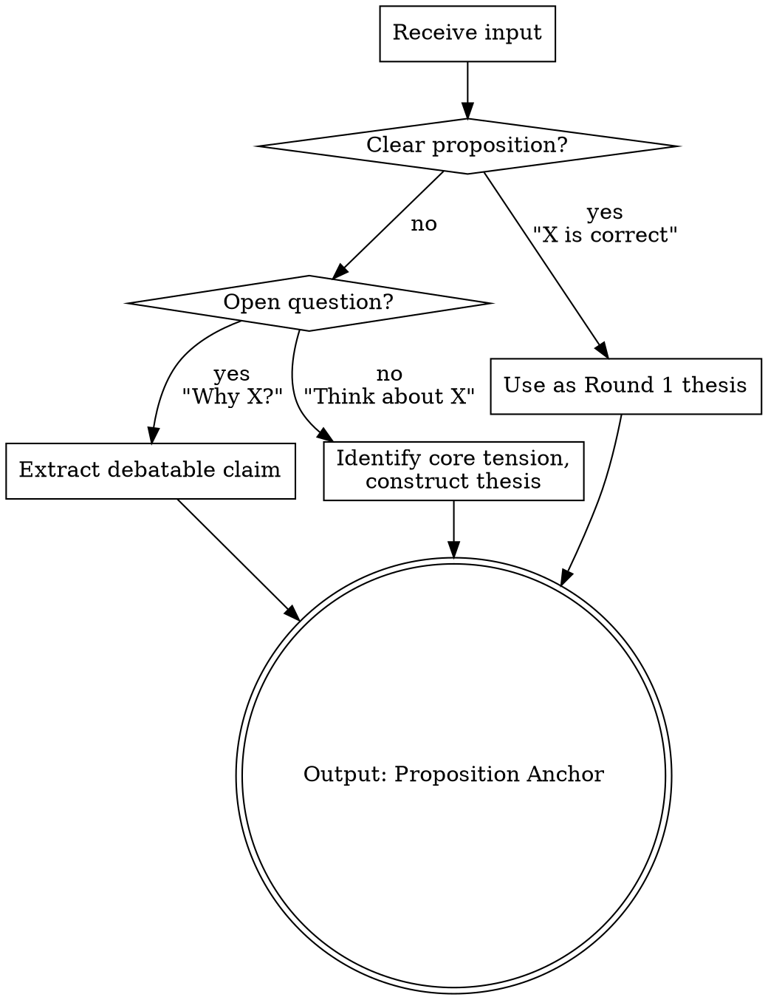
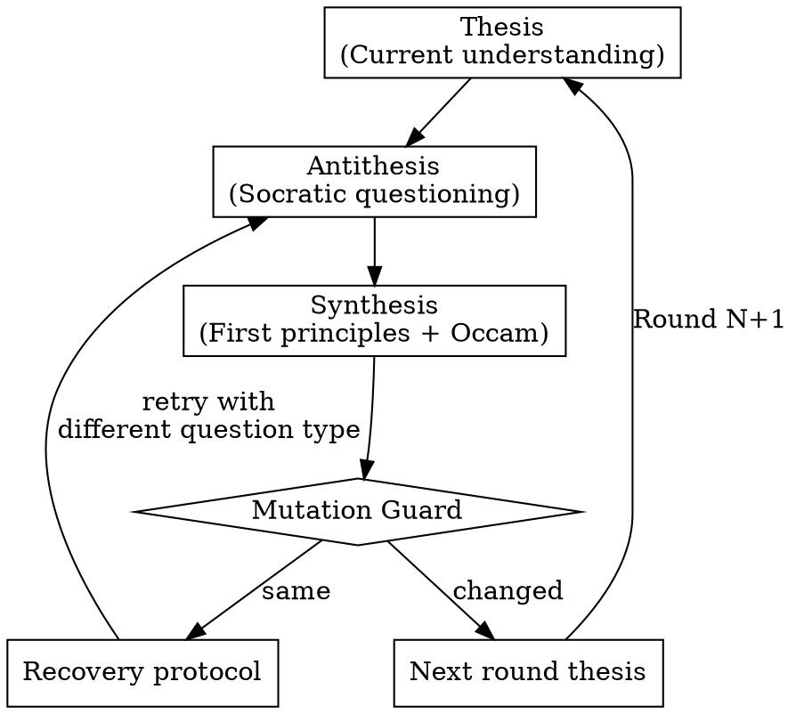

# Socrates -- Dialectical Thinking Engine

## Overview

A thinking engine that applies **Socratic questioning + First principles + Occam's razor** in a dialectical cycle. Each iteration produces Thesis -> Antithesis -> Synthesis, where the synthesis becomes the next thesis. The cycle continues until the user interrupts.

This skill does not solve problems. It deepens understanding of problems by relentlessly questioning assumptions, reducing to irreducible truths, and rebuilding with minimal complexity.

## When to Use

**Trigger on:**
- User asks for deep analysis, first principles thinking, or assumption questioning
- Complex decisions with non-obvious trade-offs
- Architectural or design choices with multiple valid approaches
- Any problem where hidden assumptions may lead to wrong conclusions
- Other skills invoke this as an internal thinking engine

**Do not trigger on:**
- Simple factual queries ("What is X?")
- Direct execution commands ("Delete this file")
- Standard operations with established best practices

## Startup Protocol

Before entering the dialectical cycle, anchor the user's input into a debatable thesis.



**Input classification:**
- **Clear proposition** ("X is the right approach") -> Use directly as Round 1 thesis
- **Open question** ("Why does X happen?") -> Extract the implicit claim and make it debatable
- **Vague intent** ("Think about X") -> Identify the core tension, construct an initial thesis

Regardless of input type, output before Round 1:

> **Proposition Anchor:** [Initial thesis statement]

This anchoring IS the first Socratic act -- "What exactly do you mean by X?"

## The Dialectical Triad (Core Loop)

Each round is a complete thesis-antithesis-synthesis cycle. The synthesis of Round N becomes the thesis of Round N+1. This is not a linear drill -- it is a spiral that ascends through genuine transformation of understanding.



### Stage 1: Thesis (Current Understanding)

**Round 1:** The anchored proposition from the Startup Protocol.
**Round N>1:** The synthesis from the previous round.

State the thesis as one clear, falsifiable sentence. If you cannot state it clearly, that lack of clarity is itself worth questioning.

### Stage 2: Antithesis (Socratic Questioning)

Challenge the thesis using the most effective question type. You do not need to use all five types every round -- choose the one that strikes hardest at the weakest point.

**Five question types:**

1. **Clarification** -- "What exactly does this concept mean? How is it being defined here?"
   Use when: terms are ambiguous, definitions are assumed, scope is unclear

2. **Assumption Probing** -- "What unexamined premise does this depend on? What if that premise is false?"
   Use when: the thesis rests on something treated as obviously true

3. **Evidence Probing** -- "What evidence supports this? How reliable is that evidence?"
   Use when: claims are presented without justification, or with weak justification

4. **Perspective Shifting** -- "What would someone who disagrees say? What does this look like from the opposite side?"
   Use when: the thesis shows only one viewpoint, or dismisses alternatives too quickly

5. **Consequence Tracing** -- "If this is true, what necessarily follows? Do those consequences hold up?"
   Use when: the thesis has unexplored implications that might be absurd or contradictory

For detailed guidance and examples of each type, read `reference/socratic-questions.md`.

**Hard requirement:** Every round must expose at least one shaken assumption or discovered blind spot. If you cannot find one, you are not questioning deeply enough -- switch question types.

### Stage 3: Synthesis (First Principles Reduction + Occam's Rebuild)

Two operations, always in this order:

**Reduce (First Principles):**
Strip away all analogies, appeals to experience, appeals to authority, and conventional wisdom. What remains that is undeniably true? List these as atomic facts.

Things that are NOT first principles:
- "Google/Amazon/Netflix does it this way" (authority)
- "This is industry best practice" (convention)
- "In my experience..." (anecdote)
- "It's generally accepted that..." (consensus)

**Rebuild (Occam's Razor):**
From only the atomic facts identified above, construct the simplest possible understanding. Add nothing that is not required by the facts. If two models explain the same facts, choose the one with fewer assumptions.

**Hard requirement:** The synthesis MUST differ from the thesis. If it does not, the Mutation Guard activates.

## Mutation Guard

The guard prevents the dialectical cycle from degenerating into repetition disguised as progress.

After producing each synthesis, compare it to the thesis:

**If synthesis differs from thesis (mutation detected):**
State what changed and proceed to next round.

**If synthesis resembles thesis (no mutation):**
1. Explicitly declare: "No mutation this round."
2. Attempt recovery:
   - Switch to a different question type than the one just used
   - Challenge a deeper-layer assumption (move from surface to structural)
   - Introduce a contrasting paradigm or extreme scenario
3. If two consecutive rounds fail to produce mutation:
   - Declare: "Epistemic boundary reached at current depth."
   - Do NOT auto-terminate. The user decides whether to continue, redirect, or stop.

Rephrasing is not mutation. Reordering is not mutation. Adding qualifiers is not mutation. Only a genuine shift in understanding counts.

## Hard Rules

These are inviolable during execution:

1. **Never skip the antithesis.** "This is obviously correct" is not an excuse to jump to synthesis. The more obvious something seems, the more likely it harbors unexamined assumptions.

2. **Never disguise repetition as mutation.** Rephrasing the thesis with different words is not a new understanding. The mutation guard exists because this is the most common failure mode.

3. **Never appeal to authority in synthesis.** "Because Google does it" or "experts agree" are not first principles. Strip these during reduction. If nothing remains after stripping authority, that itself is a finding.

4. **Never converge prematurely.** Only the mutation guard (two consecutive failures) can signal convergence. Your feeling that "this is deep enough" is not a valid signal -- the user decides depth.

5. **Every round must expose at least one assumption.** If no assumption surfaces, the questioning was not deep enough. Switch question types or target a different aspect of the thesis.

## Red Flags -- Stop and Correct

If you catch yourself thinking any of these, you are rationalizing:

| Thought | What it actually means |
|---------|----------------------|
| "This conclusion is obvious" | Obvious = unexamined. Question it. |
| "I've gone deep enough" | You are not the judge of depth. The user is. Continue. |
| "This round is about the same as the last" | Trigger mutation guard. Switch question strategy. |
| "There are no more assumptions to find" | Switch question type. There are always hidden assumptions. |
| "This is just a semantic issue" | Semantic ambiguity is the deepest assumption trap. Clarify it. |
| "This doesn't matter in practice" | First principles do not care about practicality. They care about truth. |

## Output Format

### Independent Mode (user-facing)

Each round outputs this structure:

```
## Round N

### Thesis
> [One sentence: current understanding]

### Antithesis
**Question type**: [Clarification / Assumption / Evidence / Perspective / Consequence]

[The questioning process -- this is the substance of the round, no length limit]

**Shaken assumption**: [Explicitly name what was undermined]

### Synthesis
**Irreducible facts**:
- [Fact 1]
- [Fact 2]

**Simplest reconstruction**:
> [New understanding -- this becomes the next thesis]

**Mutation**: [Yes: what shifted / No: activating mutation guard]

---
Continuing...
```

### Engine Mode (called by other skills)

When another skill invokes Socrates as a thinking engine, behavior changes:

- Run silently, do not output intermediate rounds to user
- Return only the final synthesis and the key derivation path
- Respect caller configuration:

```
[socrates-config]
max_rounds: 3
focus: "architecture decision"
return: "final_synthesis"
[/socrates-config]
```

| Config key | Values | Default |
|-----------|--------|---------|
| max_rounds | integer | unlimited |
| focus | string (narrows scope) | none |
| return | "final_synthesis" or "full_chain" | "final_synthesis" |

## Engineering Specialization

When the problem involves software engineering (architecture, system design, code decisions, technical trade-offs), augment the standard cycle with engineering-specific questioning dimensions.

Read `reference/engineering.md` for the full overlay. The overlay adds to the standard cycle -- it never replaces it.

Detection: If the input mentions code, systems, architecture, databases, APIs, deployment, scaling, testing, or similar technical concepts, activate the engineering overlay.

## Reference

- **Socratic question types in depth**: Read `reference/socratic-questions.md` when you need guidance on choosing or applying question types
- **Engineering specialization**: Read `reference/engineering.md` when the problem is in the software engineering domain
